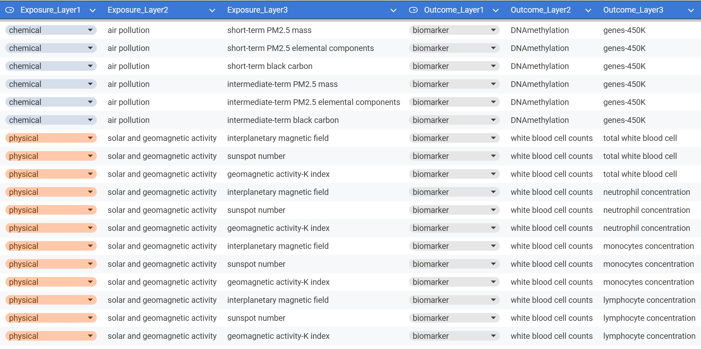
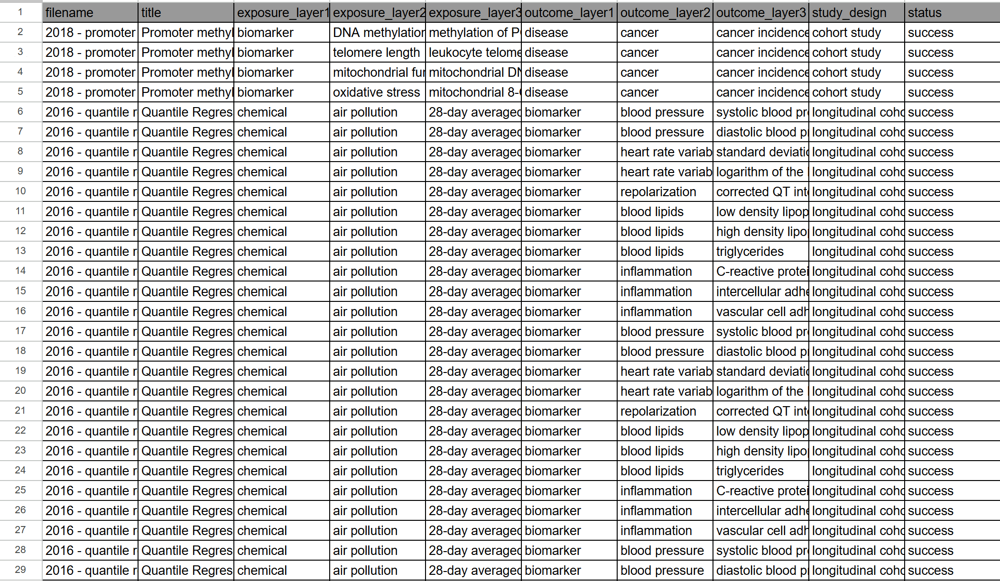

# AI-Powered Environmental Health Literature Extraction Pipeline

Automated extraction of environmental exposures and health outcomes from scientific literature using a structured 3-layer taxonomy and large language models.

---

## 1. Business Problem

Environmental health research often requires reviewing large volumes of scientific literature to identify how different exposures (such as air pollution, heavy metals, or diet) influence human health outcomes like cardiovascular or respiratory diseases.

This process is typically manual, time-consuming, and difficult to scale.

The goal of this project is to develop an automated approach that extracts these relationships directly from research papers using AI, allowing for faster and more consistent analysis.

---

## 2. Project Overview

| Component | Description |
|----------|------------|
| Objective | Extract exposure–outcome relationships from scientific literature |
| Method | LLM-based extraction guided by a 3-layer taxonomy |
| Models | GPT-3.5 (baseline), GPT-4o (advanced) |
| Evaluation Data | 86 papers (Phase 4), 121 papers (Phase 5) |
| Best Result | F1 score above 96% at Layer 1 |
| Coverage | 100% of papers successfully processed |

---

## 3. Data

### Ground Truth Dataset
- Source: VA Normative Aging Study  
- File: `CohortNetwork_ES&T_SI_B_Main.xlsx`  
- Description: Expert-annotated exposure–outcome relationships  
- Size: 428 labeled pairs across 121 papers  

### Research Papers Dataset
- File: `output_11.csv`  
- Description: Collection of scientific articles used as input  

### Taxonomy
- Structured into 3 hierarchical levels  
- Contains over 100 detailed exposure and outcome categories  

---

## 4. Data Preprocessing

- Retrieved abstracts using PubMed and related sources  
- Identified and collected full-text documents  
- Extracted content from PDFs  
- Cleaned and standardized text data  
- Prepared structured input for model processing  

---

## 5. Exploratory Data Analysis

Key observations:

- Most studies focus on air pollution and heavy metal exposure  
- Cardiovascular and respiratory outcomes appear most frequently  
- Fewer observations are available in deeper taxonomy levels  

### Example Data Distribution 

---

## 6. Modeling Approach

### Baseline Model (GPT-3.5)
- Uses abstracts only  
- Faster and more cost-efficient  
- Limited by reduced context  

### Advanced Model (GPT-4o)
- Uses full-text documents  
- Provides richer context and improved accuracy  
- Higher computational cost  

---

## 7. Model Comparison

| Model   | Input Type | Strengths        | Limitations       | Performance |
|--------|-----------|------------------|------------------|------------|
| GPT-3.5 | Abstracts | Fast, low cost   | Limited context   | ~61% accuracy |
| GPT-4o  | Full Text | More accurate    | Higher cost       | 96%+ F1 score |

---

## 8. Model Training

- Prompt design based on taxonomy categories  
- Low temperature for consistent outputs  
- Semantic matching used to evaluate predictions  
- Similarity threshold applied (~0.75)  

---

## 9. Results

### Phase 4 (Validation)

- Conducted on 86 papers using abstracts  
- Achieved ~61% accuracy at Layer 1  
- Performance decreased for deeper classification levels  
- Main limitation: incomplete context from abstracts  

---

### Phase 5 (Full Pipeline)

- Applied to 121 full-text papers  
- 100% of papers processed successfully  
- Improved extraction quality compared to Phase 4  
- Semantic matching significantly improved evaluation results  

---

### Performance Summary

#### Phase 4 – Abstract-Based Extraction (Validation)

| Category        | Layer 1 | Layer 2 | Layer 3 |
|----------------|--------|--------|--------|
| Exposure Accuracy | 79.1% | 58.1% | 52.3% |
| Outcome Accuracy  | 43.5% | 60.0% | 51.8% |
| Combined Accuracy | 61.4% | 59.1% | 52.0% |

---

#### Phase 5 – Full Pipeline (Baseline Metrics)

| Metric            | Precision (%) | Recall (%) | F1 Score (%) |
|------------------|-------------|-----------|-------------|
| Exposure Layer 1 | 86.96 | 36.59 | 51.50 |
| Exposure Layer 2 | 62.26 | 17.04 | 26.76 |
| Exposure Layer 3 | 26.32 | 11.22 | 15.73 |
| Outcome Layer 1  | 86.15 | 54.11 | 66.47 |
| Outcome Layer 2  | 53.95 | 10.65 | 17.79 |
| Outcome Layer 3  | 23.90 | 8.75  | 12.81 |

---

#### Phase 5 – Full Pipeline with Semantic Strategies (Best Results)

| Metric            | Precision (%) | Recall (%) | F1 Score (%) |
|------------------|-------------|-----------|-------------|
| Exposure Layer 1 | 100.00 | 94.06 | 96.94 |
| Exposure Layer 2 | 84.89  | 91.42 | 88.03 |
| Exposure Layer 3 | 83.52  | 93.83 | 88.37 |
| Outcome Layer 1  | 99.39  | 93.16 | 96.18 |
| Outcome Layer 2  | 89.36  | 89.36 | 89.36 |
| Outcome Layer 3  | 65.96  | 82.82 | 73.43 |

---

#### Coverage

| Metric                | Value |
|----------------------|------|
| Papers with Match    | 119 / 121 |
| Coverage Percentage  | 98.35% |

---

### Example Output

 

### Output Files

- `Phase5_extraction_results.csv`  
- `Phase5_extraction_results_metrics.csv`  
- `Phase5_extraction_results_with_strategies.csv`  
- `Phase5_extraction_results_with_strategies_metrics.csv`  
- `aggressive_semantic_extraction_*.csv`  

These files contain extracted relationships, evaluation metrics, and comparisons across different extraction strategies.


---

## 10. Model Interpretation

Model predictions are influenced by:

- Similarity between text and taxonomy categories  
- Presence of key exposure and outcome terms  
- Context within full-text documents  

### Strengths
- Performs well when terminology is clearly stated  
- Can extract multiple relationships from a single paper  

### Limitations
- Sensitive to wording differences  
- More difficult to detect implicit relationships  

---

## 11. Key Insights

- Taxonomy-guided prompts improve consistency  
- Full-text input significantly increases performance  
- Evaluation method impacts reported accuracy  
- Automation reduces analysis time from hours to minutes  

---

## 12. Conclusion

This project demonstrates that large language models can effectively automate the extraction of structured information from environmental health literature.

The approach is scalable and can support large-scale research analysis.

---

## 13. Future Work

- Improve handling of synonyms and variations  
- Expand dataset size  
- Introduce confidence scoring  
- Develop a user interface  

---

## 14. How to Run

1. Clone the repository:

```bash
git clone YOUR_REPOSITORY_LINK
cd YOUR_REPOSITORY_NAME
```

2. Install dependencies:

```bash
pip install -r requirements.txt
```

3. Set your OpenAI API key:

Create a `.env` file in the root directory and add:

```
OPENAI_API_KEY=your_key_here
```
4. Run the notebooks in order:

- Phase1.ipynb  
- Phase_2_PubMed.ipynb  
- Phase_3.ipynb  
- Phase_4.ipynb  
- Phase_5.ipynb
---

## 15. Repository Structure

```bash
├── images/
│   ├── Phase5output.png
│   ├── datalayer.png
│   └── UTA-DataScience-Logo.png
│
├── data/
│   ├── output_11.csv
│   └── CohortNetwork_ES&T_SI_B_Main.xlsx
│
├── important_results/
│   ├── Phase5_extraction_results.csv
│   ├── Phase5_extraction_results_metrics.csv
│   ├── Phase5_extraction_results_with_strategies.csv
│   └── Phase5_extraction_results_with_strategies_metrics.csv
│
├── notebooks/
│   ├── Phase_1.ipynb
│   ├── Phase_2_PubMed.ipynb
│   ├── Phase_3.ipynb
│   ├── Phase_4.ipynb
│   └── Phase_5.ipynb
│
├── README.md
└── requirements.txt
```

---

## 16. Requirements

```bash
pip install -r requirements.txt
```
---
## Credits

Developed by Laura Tambwe and Byrnes Mulumbeni  
DATA 4382 Capstone, University of Texas at Arlington, Spring 2026  
Advisor: Dr. Yike Shen
